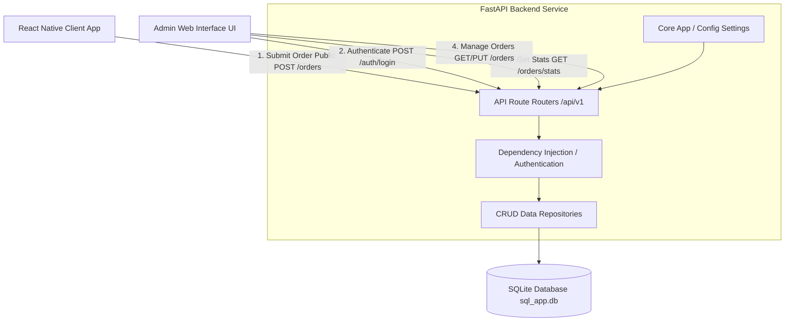

# System Architecture & API Documentation (POC)

This document provides a high-level overview of the backend architecture, database schemas, and API lists developed for the Customer Order Management Proof of Concept (POC).

---

## 1. System Architecture Diagram

Below is the conceptual architecture showing how the **React Native App** and the **Admin Web Interface** integrate with our **FastAPI Backend** and the local **SQLite Database**.



---

## 2. Database Schema (High Level)

The backend manages two main tables in the SQLite database:

### A. `users` Table
Stores user records and credentials for Admin Web Interface logins.

| Column | Type | Constraints | Description |
| :--- | :--- | :--- | :--- |
| `id` | `INTEGER` | Primary Key, Auto-increment | Unique identifier for the user |
| `email` | `VARCHAR` | Unique, Indexed, Not Null | Admin email/username for login |
| `hashed_password` | `VARCHAR` | Not Null | Securely hashed password (bcrypt) |
| `full_name` | `VARCHAR` | Indexed | Complete name of the user |
| `is_active` | `BOOLEAN` | Default: `True` | Flags if account is active |
| `is_superuser` | `BOOLEAN` | Default: `False` | Flags if user has admin dashboard privileges |

### B. `orders` Table
Stores customer orders placed by the React Native application.

| Column | Type | Constraints | Description |
| :--- | :--- | :--- | :--- |
| `id` | `INTEGER` | Primary Key, Auto-increment | Unique identifier for the order |
| `customer_name` | `VARCHAR` | Indexed, Not Null | Customer full name |
| `customer_email` | `VARCHAR` | Indexed, Nullable | Customer email |
| `items` | `JSON` | Not Null | List of ordered items (name, quantity, price) |
| `total_amount` | `FLOAT` | Not Null | Total order price |
| `status` | `VARCHAR` | Default: `"Pending"`, Indexed | Order state: `Pending`, `Approved`, `Rejected`, `Completed` |
| `created_at` | `DATETIME` | Default: `UTC Now`, Not Null | Order timestamp |

---

## 3. API List

All API endpoints are prefixed with `/api/v1`.

### A. Authentication API

#### `POST /auth/login`
- **Access**: Public
- **Description**: Exchanges admin credentials for a JWT Access Token.
- **Request Type**: `application/x-www-form-urlencoded`
- **Request Form Parameters**:
  - `username` (string, email)
  - `password` (string)
- **Response Example (`200 OK`)**:
  ```json
  {
    "access_token": "eyJhbGciOiJIUzI1NiIsIn...",
    "token_type": "bearer"
  }
  ```

---

### B. Customer Orders API (React Native App Integration)

#### `POST /orders/`
- **Access**: Public (no token required)
- **Description**: Creates a new customer order. Used by the React Native application.
- **Request Type**: `application/json`
- **Request Body Example**:
  ```json
  {
    "customer_name": "Jane Smith",
    "customer_email": "jane@example.com",
    "items": [
      {
        "name": "Item A",
        "quantity": 2,
        "price": 12.50
      },
      {
        "name": "Item B",
        "quantity": 1,
        "price": 25.00
      }
    ],
    "total_amount": 50.00
  }
  ```
- **Response Example (`200 OK`)**:
  ```json
  {
    "id": 1,
    "customer_name": "Jane Smith",
    "customer_email": "jane@example.com",
    "items": [
      {
        "name": "Item A",
        "quantity": 2,
        "price": 12.50
      },
      {
        "name": "Item B",
        "quantity": 1,
        "price": 25.00
      }
    ],
    "total_amount": 50.00,
    "status": "Pending",
    "created_at": "2026-07-03T09:23:00Z"
  }
  ```

---

### C. Admin Web Interface APIs

These endpoints require an `Authorization: Bearer <access_token>` header in the HTTP requests.

#### `GET /orders/`
- **Access**: Admin/Superuser Only
- **Description**: Retrieves a paginated list of all customer orders (newest first).
- **Query Parameters**:
  - `skip` (integer, default: 0)
  - `limit` (integer, default: 100)
- **Response Example (`200 OK`)**:
  ```json
  [
    {
      "id": 1,
      "customer_name": "Jane Smith",
      "customer_email": "jane@example.com",
      "items": [...],
      "total_amount": 50.00,
      "status": "Pending",
      "created_at": "2026-07-03T09:23:00Z"
    }
  ]
  ```

#### `GET /orders/stats`
- **Access**: Admin/Superuser Only
- **Description**: Retrieves statistics counts to render the dashboard charts/cards.
- **Response Example (`200 OK`)**:
  ```json
  {
    "total_orders": 25,
    "pending_orders": 10,
    "approved_orders": 5,
    "completed_orders": 8,
    "rejected_orders": 2
  }
  ```

#### `GET /orders/{order_id}`
- **Access**: Admin/Superuser Only
- **Description**: Retrieves detailed information for a single order by ID.
- **Response Example (`200 OK`)**:
  ```json
  {
    "id": 1,
    "customer_name": "Jane Smith",
    "customer_email": "jane@example.com",
    "items": [
      {
        "name": "Item A",
        "quantity": 2,
        "price": 12.5
      }
    ],
    "total_amount": 25.00,
    "status": "Pending",
    "created_at": "2026-07-03T09:23:00Z"
  }
  ```

#### `PUT /orders/{order_id}/status`
- **Access**: Admin/Superuser Only
- **Description**: Updates order status (e.g., Approve, Complete, Reject).
- **Request Type**: `application/json`
- **Request Body Example**:
  ```json
  {
    "status": "Approved"
  }
  ```
- **Response Example (`200 OK`)**:
  ```json
  {
    "id": 1,
    "customer_name": "Jane Smith",
    "customer_email": "jane@example.com",
    "items": [...],
    "total_amount": 25.00,
    "status": "Approved",
    "created_at": "2026-07-03T09:23:00Z"
  }
  ```
