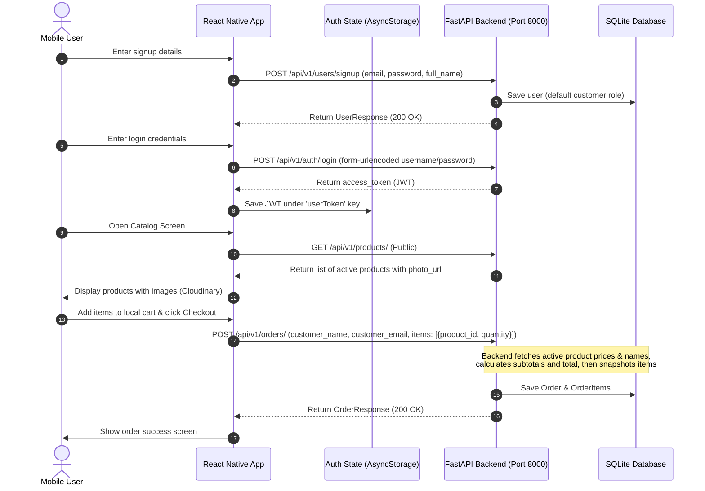

# ChemCom Mobile Frontend Integration Guide

This guide provides technical reference and copy-pasteable React Native integration patterns for connecting the mobile client to the FastAPI backend.

---

## 1. Architectural Overview & Flow



---

## 2. Connection Guidelines

### Base URL Strategy
* **Local Emulator/Device Testing**:
  * **Do NOT use `localhost` or `127.0.0.1`**; these loopback addresses refer to the mobile device/emulator itself.
  * Use your development machine's local network IP address (e.g., `http://192.168.1.50:8000`).
* **Production**:
  * Use `https://chemcom-backend.onrender.com`.

### Common Mobile Networking Gotchas

> [!WARNING]
> **Cleartext (HTTP) Constraints**:
> * **Android**: By default, Android blocks cleartext (non-HTTPS) traffic. For local development over `http://`, you must update your `android/app/src/main/AndroidManifest.xml` under `<application>` to include:
>   ```xml
>   android:usesCleartextTraffic="true"
>   ```
> * **iOS**: You must configure App Transport Security (ATS) exceptions in `ios/YourAppName/Info.plist`:
>   ```xml
>   <key>NSAppTransportSecurity</key>
>   <dict>
>       <key>NSAllowsLocalNetworking</key>
>       <true/>
>   </dict>
>   ```

### Header Formats
* **Public Requests (Signup, Fetch Products)**:
  ```http
  Content-Type: application/json
  ```
* **Authentication Login**:
  ```http
  Content-Type: application/x-www-form-urlencoded
  ```
* **Private Requests (Profile, User Orders)**:
  ```http
  Content-Type: application/json
  Authorization: Bearer <your_access_token>
  ```

---

## 3. API Contract Reference

The following table summarizes the endpoints the mobile app integrates with. All paths are prefixed with `/api/v1`.

| Endpoint | Method | Headers | Description |
| :--- | :--- | :--- | :--- |
| [`/users/signup`](file:///c:/Users/Pratham/OneDrive/Documents/Desktop/Backend-ChemCom/app/api/v1/endpoints/users.py#L49) | `POST` | JSON | Registers a new customer user account |
| [`/auth/login`](file:///c:/Users/Pratham/OneDrive/Documents/Desktop/Backend-ChemCom/app/api/v1/endpoints/auth.py) | `POST` | Form-Urlencoded | Logs in user, returning JWT access token |
| [`/users/me`](file:///c:/Users/Pratham/OneDrive/Documents/Desktop/Backend-ChemCom/app/api/v1/endpoints/users.py#L111) | `GET` | Bearer Token | Retrieves authenticated user profile details |
| [`/users/me`](file:///c:/Users/Pratham/OneDrive/Documents/Desktop/Backend-ChemCom/app/api/v1/endpoints/users.py#L121) | `PUT` | Bearer Token, JSON | Updates logged-in user profile details / password |
| [`/users/{user_id}/orders`](file:///c:/Users/Pratham/OneDrive/Documents/Desktop/Backend-ChemCom/app/api/v1/endpoints/users.py#L152) | `GET` | Bearer Token | Retrieves all past orders placed by the user |
| [`/products/`](file:///c:/Users/Pratham/OneDrive/Documents/Desktop/Backend-ChemCom/app/api/v1/endpoints/products.py#L62) | `GET` | None (Public) | Retrieves list of all active products |
| [`/products/{product_id}`](file:///c:/Users/Pratham/OneDrive/Documents/Desktop/Backend-ChemCom/app/api/v1/endpoints/products.py#L89) | `GET` | None (Public) | Retrieves details of a single product |
| [`/orders/`](file:///c:/Users/Pratham/OneDrive/Documents/Desktop/Backend-ChemCom/app/api/v1/endpoints/orders.py#L13) | `POST` | None (Public) | Places a new order (price lookup occurs on backend) |

---

## 4. Endpoint Specifications

### A. Authentication & Users

#### 1. Self-Registration (Sign up)
Creates a new customer account.

* **Path**: `/api/v1/users/signup`
* **Method**: `POST`
* **Request JSON**:
  ```json
  {
    "email": "customer@example.com",
    "password": "securepassword123",
    "full_name": "Jane Doe"
  }
  ```
* **Success Response (`200 OK`)**:
  ```json
  {
    "id": 14,
    "email": "customer@example.com",
    "is_active": true,
    "is_superuser": false,
    "full_name": "Jane Doe"
  }
  ```

#### 2. Retrieve Token (Login)
Exchange credentials for a JWT.

* **Path**: `/api/v1/auth/login`
* **Method**: `POST`
* **Request Body (Form URL Encoded)**:
  * `username` = `customer@example.com`
  * `password` = `securepassword123`
* **Success Response (`200 OK`)**:
  ```json
  {
    "access_token": "eyJhbGciOiJIUzI1Ni...",
    "token_type": "bearer"
  }
  ```

#### 3. Fetch Personal Profile
Verify login state and fetch metadata.

* **Path**: `/api/v1/users/me`
* **Method**: `GET`
* **Headers**: `Authorization: Bearer <access_token>`
* **Success Response (`200 OK`)**:
  ```json
  {
    "id": 14,
    "email": "customer@example.com",
    "is_active": true,
    "is_superuser": false,
    "full_name": "Jane Doe"
  }
  ```

---

### B. Product Catalog (Public)

#### 1. List Active Products
Fetches all active items to display in the shop.

* **Path**: `/api/v1/products/`
* **Method**: `GET`
* **Success Response (`200 OK`)**:
  ```json
  [
    {
      "id": 1,
      "name": "Heavy Duty ChemCom Glove",
      "description": "Chemical resistant gloves with premium grip.",
      "price": 14.99,
      "photo_url": "https://res.cloudinary.com/cloud-name/image/upload/v12345/products/glove.jpg",
      "is_active": true,
      "created_at": "2026-07-08T06:54:45Z"
    },
    {
      "id": 2,
      "name": "Standard Protective Goggles",
      "description": "Anti-fog protective eyewear.",
      "price": 9.50,
      "photo_url": null,
      "is_active": true,
      "created_at": "2026-07-08T06:55:10Z"
    }
  ]
  ```

---

### C. Cart & Checkout (Public)

#### 1. Place Customer Order
Submits cart items to the store.

> [!IMPORTANT]
> **Client-Side Pricing Rules**:
> To prevent users from altering prices, the backend does **not** accept prices, totals, or item names from the client.
> * The client sends **only** `product_id` and `quantity`.
> * The backend queries the current prices and names from the `Product` database, checks if they are active, computes subtotals, sums up the `total_amount`, and records the order.

* **Path**: `/api/v1/orders/`
* **Method**: `POST`
* **Request JSON**:
  ```json
  {
    "customer_name": "Jane Doe",
    "customer_email": "customer@example.com",
    "items": [
      {
        "product_id": 1,
        "quantity": 2
      },
      {
        "product_id": 2,
        "quantity": 1
      }
    ]
  }
  ```
* **Success Response (`200 OK`)**:
  ```json
  {
    "id": 42,
    "customer_name": "Jane Doe",
    "customer_email": "customer@example.com",
    "items": [
      {
        "product_id": 1,
        "name": "Heavy Duty ChemCom Glove",
        "quantity": 2,
        "price": 14.99
      },
      {
        "product_id": 2,
        "name": "Standard Protective Goggles",
        "quantity": 1,
        "price": 9.50
      }
    ],
    "total_amount": 39.48,
    "status": "Pending",
    "created_at": "2026-07-08T13:00:00Z"
  }
  ```

---

### D. Order History (Authenticated)

#### 1. Fetch User Orders
Fetches previous purchases for the authenticated customer.

* **Path**: `/api/v1/users/{user_id}/orders`
* **Method**: `GET`
* **Headers**: `Authorization: Bearer <access_token>`
* **Success Response (`200 OK`)**:
  ```json
  [
    {
      "id": 42,
      "customer_name": "Jane Doe",
      "customer_email": "customer@example.com",
      "items": [
        {
          "product_id": 1,
          "name": "Heavy Duty ChemCom Glove",
          "quantity": 2,
          "price": 14.99
        }
      ],
      "total_amount": 29.98,
      "status": "Pending",
      "created_at": "2026-07-08T13:00:00Z"
    }
  ]
  ```

---

## 5. React Native Integration Templates

### A. Authentication & Network Service
This service manages login, signup, token storage, and authenticated HTTP fetches. It is recommended to use `AsyncStorage` for local token persistence.

```javascript
import AsyncStorage from '@react-native-async-storage/async-storage';

// Replace with your local machine's IP address when running on physical/emulator devices
const BASE_URL = 'http://192.168.1.50:8000/api/v1';

export const ApiService = {
  // Save JWT Access Token
  async saveToken(token) {
    await AsyncStorage.setItem('userToken', token);
  },

  // Read JWT Access Token
  async getToken() {
    return await AsyncStorage.getItem('userToken');
  },

  // Remove JWT Access Token (Logout)
  async clearToken() {
    await AsyncStorage.removeItem('userToken');
  },

  // Helper for Authenticated GET requests
  async authGet(endpoint) {
    const token = await this.getToken();
    const response = await fetch(`${BASE_URL}${endpoint}`, {
      method: 'GET',
      headers: {
        'Authorization': `Bearer ${token}`,
        'Content-Type': 'application/json',
      },
    });
    
    if (!response.ok) {
      const err = await response.json();
      throw new Error(err.detail || 'Fetch failed');
    }
    return await response.json();
  },

  // Register user account
  async signup(email, password, fullName) {
    const response = await fetch(`${BASE_URL}/users/signup`, {
      method: 'POST',
      headers: {
        'Content-Type': 'application/json',
      },
      body: JSON.stringify({ email, password, full_name: fullName }),
    });

    const data = await response.json();
    if (!response.ok) {
      throw new Error(data.detail || 'Signup failed');
    }
    return data;
  },

  // Exchange username & password for Token
  async login(email, password) {
    const details = {
      'username': email,
      'password': password,
    };

    // OAuth2 expects Form URL Encoded payload
    const formBody = Object.keys(details)
      .map(key => encodeURIComponent(key) + '=' + encodeURIComponent(details[key]))
      .join('&');

    const response = await fetch(`${BASE_URL}/auth/login`, {
      method: 'POST',
      headers: {
        'Content-Type': 'application/x-www-form-urlencoded;charset=UTF-8',
      },
      body: formBody,
    });

    const data = await response.json();
    if (!response.ok) {
      throw new Error(data.detail || 'Login failed');
    }
    
    // Save Token
    await this.saveToken(data.access_token);
    return data;
  },

  // Fetch current user details
  async getProfile() {
    return await this.authGet('/users/me');
  }
};
```

---

### B. Catalog Screen Integration (React Native Component)
Demonstrates displaying products fetched from the API with Cloudinary images and standard UI loading states.

```jsx
import React, { useEffect, useState } from 'react';
import { 
  StyleSheet, 
  Text, 
  View, 
  FlatList, 
  Image, 
  ActivityIndicator, 
  TouchableOpacity 
} from 'react-native';

const PRODUCTS_URL = 'http://192.168.1.50:8000/api/v1/products/';
const PLACEHOLDER_IMAGE = 'https://via.placeholder.com/150';

export default function ProductCatalogScreen({ onAddToCart }) {
  const [products, setProducts] = useState([]);
  const [loading, setLoading] = useState(true);
  const [error, setError] = useState(null);

  useEffect(() => {
    fetchProducts();
  }, []);

  const fetchProducts = async () => {
    try {
      setLoading(true);
      const response = await fetch(PRODUCTS_URL);
      if (!response.ok) {
        throw new Error('Could not retrieve catalog');
      }
      const data = await response.json();
      setProducts(data);
    } catch (err) {
      setError(err.message);
    } finally {
      setLoading(false);
    }
  };

  if (loading) {
    return (
      <View style={styles.centered}>
        <ActivityIndicator size="large" color="#005B94" />
      </View>
    );
  }

  if (error) {
    return (
      <View style={styles.centered}>
        <Text style={styles.errorText}>Error: {error}</Text>
        <TouchableOpacity style={styles.retryButton} onPress={fetchProducts}>
          <Text style={styles.buttonText}>Retry</Text>
        </TouchableOpacity>
      </View>
    );
  }

  const renderProductItem = ({ item }) => (
    <View style={styles.productCard}>
      <Image 
        source={{ uri: item.photo_url || PLACEHOLDER_IMAGE }} 
        style={styles.productImage}
        resizeMode="cover"
      />
      <View style={styles.infoContainer}>
        <Text style={styles.productName} numberOfLines={1}>{item.name}</Text>
        <Text style={styles.productDescription} numberOfLines={2}>{item.description}</Text>
        <View style={styles.cardFooter}>
          <Text style={styles.productPrice}>${item.price.toFixed(2)}</Text>
          <TouchableOpacity 
            style={styles.addButton} 
            onPress={() => onAddToCart(item)}
          >
            <Text style={styles.addButtonText}>Add to Cart</Text>
          </TouchableOpacity>
        </View>
      </View>
    </View>
  );

  return (
    <View style={styles.container}>
      <Text style={styles.header}>Industrial Catalog</Text>
      <FlatList
        data={products}
        keyExtractor={(item) => item.id.toString()}
        renderItem={renderProductItem}
        contentContainerStyle={styles.listContent}
      />
    </View>
  );
}

const styles = StyleSheet.create({
  container: { flex: 1, backgroundColor: '#F8F9FA' },
  centered: { flex: 1, justifyContent: 'center', alignItems: 'center', backgroundColor: '#F8F9FA' },
  header: { fontSize: 24, fontWeight: 'bold', margin: 16, color: '#333' },
  listContent: { paddingBottom: 16 },
  productCard: {
    backgroundColor: '#FFF',
    marginHorizontal: 16,
    marginBottom: 12,
    borderRadius: 8,
    overflow: 'hidden',
    elevation: 2,
    shadowColor: '#000',
    shadowOpacity: 0.1,
    shadowOffset: { width: 0, height: 2 },
    shadowRadius: 4,
  },
  productImage: { width: '100%', height: 160 },
  infoContainer: { padding: 12 },
  productName: { fontSize: 18, fontWeight: 'bold', color: '#333', marginBottom: 4 },
  productDescription: { fontSize: 14, color: '#777', marginBottom: 12 },
  cardFooter: { flexDirection: 'row', justifyContent: 'space-between', alignItems: 'center' },
  productPrice: { fontSize: 18, fontWeight: 'bold', color: '#005B94' },
  addButton: { backgroundColor: '#005B94', paddingVertical: 8, paddingHorizontal: 16, borderRadius: 4 },
  addButtonText: { color: '#FFF', fontWeight: 'bold', fontSize: 14 },
  errorText: { fontSize: 16, color: 'red', marginBottom: 12 },
  retryButton: { backgroundColor: '#005B94', padding: 10, borderRadius: 4 },
  buttonText: { color: '#FFF', fontWeight: 'bold' }
});
```

---

### C. Local Cart State & Checkout Order Submission
Demonstrates storing the cart items using local React context/state, and executing order placement securely by passing only ID and Quantity.

```javascript
import React, { useState } from 'react';
import { Alert } from 'react-native';

const ORDERS_ENDPOINT = 'http://192.168.1.50:8000/api/v1/orders/';

export const useCart = (currentUser) => {
  const [cart, setCart] = useState([]);

  // Add Item to cart
  const addToCart = (product) => {
    setCart((prevCart) => {
      const existing = prevCart.find((item) => item.product_id === product.id);
      if (existing) {
        return prevCart.map((item) =>
          item.product_id === product.id ? { ...item, quantity: item.quantity + 1 } : item
        );
      }
      return [...prevCart, { product_id: product.id, name: product.name, price: product.price, quantity: 1 }];
    });
  };

  // Submit checkout order
  const checkout = async () => {
    if (cart.length === 0) {
      Alert.alert('Empty Cart', 'Please add items to your cart before checking out.');
      return;
    }

    try {
      // Map cart details down to only product_id and quantity for security
      const payload = {
        customer_name: currentUser ? currentUser.full_name : 'Guest Customer',
        customer_email: currentUser ? currentUser.email : 'guest@example.com',
        items: cart.map((item) => ({
          product_id: item.product_id,
          quantity: item.quantity,
        })),
      };

      const response = await fetch(ORDERS_ENDPOINT, {
        method: 'POST',
        headers: {
          'Content-Type': 'application/json',
        },
        body: JSON.stringify(payload),
      });

      const result = await response.json();
      if (!response.ok) {
        throw new Error(result.detail || 'Checkout failed');
      }

      // Success
      Alert.alert('Order Placed!', `Your order ID is #${result.id}. Total amount: $${result.total_amount.toFixed(2)}`);
      setCart([]); // Reset Cart
      return result;
    } catch (error) {
      Alert.alert('Error', error.message);
    }
  };

  return {
    cart,
    addToCart,
    checkout,
  };
};
```
